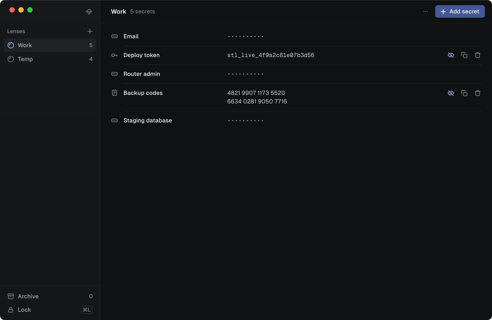

# Still

**An offline password and secret manager for your Mac, for people who want their passwords, API keys and private notes kept on their own computer instead of in someone's cloud.**

No account, no sync, no telemetry. Still never connects to the internet.

> **Early pre-release (v0.5.0).** Still is young. Don't make it the only place you keep anything you can't afford to lose, and read [Known issues](#known-issues).



## Features

- **One master password.** It unlocks everything. The key is derived with Argon2id at libsodium's highest-cost ("sensitive") setting, which makes guessing the password slow and expensive.
- **Lenses.** Separate collections for different parts of your life, such as work, personal or banking. Each Lens has its own encryption key.
- **Three kinds of secret:** passwords, API keys or tokens, and multi-line secure notes. Reveal, copy, edit or delete a secret, and rename a Lens. A copied secret is cleared from the clipboard after 30 seconds.
- **Search** every Lens by label or Lens name with ⌘F. Values stay encrypted and are never searched.
- **A 7-day Archive.** A Lens you forget moves to the Archive for 7 days, where you can restore it or delete it for good.
- **Lock and auto-lock.** One click, or ⌘L, returns Still to the password screen and wipes its keys from memory. Still also locks itself after 5 minutes without activity, and whenever your Mac goes to sleep.
- **Light and dark,** following your Mac's appearance, and usable with the keyboard and screen readers.
- **Offline by design.** No servers, no accounts and no analytics. Your vault is a single private file on your Mac.
- **Open source** under the MIT licence. Read the code, or build it yourself instead of trusting a download.

Not there yet: editing a saved secret, renaming a Lens, and search.

## What's encrypted

Still uses [libsodium](https://doc.libsodium.org/), a widely used and audited crypto library, from its Rust code. It doesn't implement any cryptography of its own, and its encryption keys never enter the app's web page.

**Encrypted:** every secret value, meaning the password, key or note itself.
- Your master password unlocks an app key using Argon2id.
- The app key unlocks a separate key for each Lens.
- Each secret is encrypted with its own key derived from that Lens key, using XChaCha20-Poly1305.

**Not encrypted yet:**
- Lens names
- secret labels (such as "Bank login")
- secret types
- dates and item counts

Anyone who can read your Mac's files can see those, but not the secret values.

[SECURITY.md](SECURITY.md) lists the other current limits and explains how to report a vulnerability privately.

## Known issues

**Fixed in v0.3.0:** deleting a secret, or a Lens in the Archive, happened with one click and couldn't be undone; it now asks first. Dialogs and buttons now work with the keyboard and screen readers.

**Fixed in v0.2.0:**
- unlocking froze the window for a few seconds;
- copied secrets stayed on the clipboard;
- Still didn't lock itself when left alone.

**Fixed in v0.1.1:** forgetting your only Lens, and changes to the last item in the Archive, weren't saved; a Lens that couldn't be read could be erased; spaces at the start or end of a secret were removed. The PIN, which never worked, is gone. The [CHANGELOG](CHANGELOG.md) has the full list.

**If you used v0.1.0:** it removed spaces and line breaks at the start or end of a secret before saving. Still can't detect or restore those characters. If a saved secret doesn't work and the real one starts or ends with a space or line break, delete it and add it again.

Still open in **v0.5.0**:

- **Lens names, labels, types and dates aren't encrypted yet.** See [What's encrypted](#whats-encrypted).
- **Clipboard-history apps may still record a copied secret.** Still asks them not to, and most respect that, but not all do.
- **Don't go back to v0.1.x after upgrading.** See [Upgrading from v0.1.x](#upgrading-from-v01x).

## Download and install

Still is a macOS app. The current release, v0.5.0, is a pre-release. It's a universal build that runs natively on both Intel and Apple Silicon Macs. It needs **Safari 15.4 or newer**, because macOS draws Still's window with Safari's engine: any Mac on macOS 10.15 or later with Safari updates installed is fine.

1. From the [Releases page](https://github.com/dan-build/Still/releases), download the `.dmg` and `SHA256SUMS.txt`.
2. Optional but recommended: check the download. In Terminal, run `cd ~/Downloads && shasum -a 256 -c SHA256SUMS.txt`. It should print the `.dmg`'s name followed by `OK`.
3. Open the `.dmg` and drag **Still** into your **Applications** folder.
4. The app isn't signed with an Apple Developer ID yet, so macOS blocks it the first time you open it. Go to **System Settings → Privacy & Security**, scroll down, and click **Open Anyway** next to the message about Still.

Your vault is the file `~/Library/Application Support/com.still.app/vault.json`, with the previous version kept as `vault.json.bak`. Deleting them deletes your vault. To back it up, quit Still and copy both files somewhere safe.

### Upgrading from v0.1.x

Install v0.2.0 over the old version. The first time it opens, Still copies your vault, unchanged, into its new file and tells you so. Your password and secrets stay the same.

- The old copy stays where v0.1.x kept it (`~/Library/WebKit/com.still.app/`). Still never changes or deletes it.
- **Don't go back to v0.1.x afterwards.** It only sees that old copy, so anything you change in v0.2.0 would seem to be missing. If an old version does change the old copy, v0.2.0 tells you, and both are kept.

There are no Windows or Linux downloads yet. Still's tests pass on both, but it hasn't been tested there as an installed app.

## Build from source

<details>
<summary>Build Still yourself instead of using the download</summary>

You need:

- **Node.js 24.** The version is in `.nvmrc`.
- **Rust**, installed through [rustup](https://rustup.rs/). `rust-toolchain.toml` pins the version, and rustup installs it for you.
- **The [Tauri prerequisites](https://tauri.app/start/prerequisites/)** for your system.

```bash
git clone https://github.com/dan-build/Still.git
cd Still
npm ci
npm run tauri:dev     # run in development
npm run tauri:build   # build the app into target/release/bundle/
npm run check         # run everything CI runs: tests, type check, Rust formatting, lints and tests
```

Development builds keep their own separate vault, so they never touch your real one.

</details>

## Roadmap

1. ~~**v0.1.1: fix the data-loss issues**~~ Done in v0.1.1, together with the first universal macOS build, built in GitHub Actions from the public source.
2. ~~**Move encryption and key handling into Rust**~~ Done in v0.2.0: keys stay out of the app's web page, unlocking no longer freezes the window, copied secrets are cleared after 30 seconds, and the vault locks itself.
3. ~~**Store the vault in its own file**~~ Done in v0.2.0: existing vaults move across on first launch, and the old copy is kept.
4. **A refreshed design.** A calmer, more polished look and feel.
5. **Encrypt Lens names and labels as well.** Older vaults will keep opening.
6. **Signed and notarised releases,** so macOS opens Still without the "Open Anyway" step.

Each step keeps existing vaults working. Tests that must open real vaults made by earlier versions check this.

## Contributing and security

- [CONTRIBUTING.md](CONTRIBUTING.md) covers how to build, test and send changes.
- [SECURITY.md](SECURITY.md) explains what Still protects, and how to report a vulnerability privately. Please don't use public issues for security reports.

## Licence

MIT. See [LICENSE](LICENSE).
